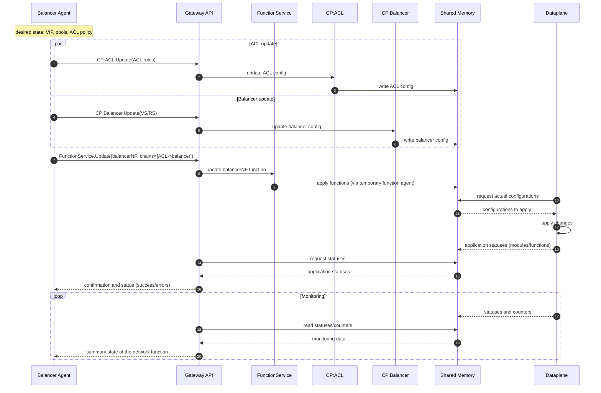

# YANET architecture overview

## Configuring the "L3" network function



## System layer pyramid

```text
                                                        +----------------+
                                                        | Cluster        |
                                                   +----+----------------+----+
                                                   | Coordinator              |
                  +------------+--------------+----+--------------------------+----+
                  | CLI        | Web UI       | Network function agents            |
             +----+------------+--------------+------------------[gRPC ]-----------+----+
             | Gateway - single entry point to modules' gRPC APIs, proxy                |
        +----+---------------------------------------------------[gRPC ]----------------+----+
        | CP - configuration, shmem fill, gRPC API                                           |
   +----+--------------------------------------------------------[SHMEM]---------------------+----+
   | Dataplane — modules, network functions, pipelines                                            |
   +----------------------------------------------------------------------------------------------+
```

**Invariants**:

- Lower layers continue to work if the upper ones fail (DP processes traffic with the last valid configuration).
- Upper layers only configure and augment the lower ones, but do not replace them.
