# YANET System Startup Process

This document describes the complete system startup sequence of YANET, from the initialization of bare dataplane to a fully operational state with active BGP route announcements.

## System Components

- **Bird**: BGP daemon that provides routes and manages external route announcements.
- **Coordinator**: Component that orchestrates the multi-stage system configuration.
- **Announcer**: Component that monitors system health and manages BGP announcement state.
- **Controlplane (CP)**: Low-level API for configuring modules and pipelines, also serving as the Gateway API interface for all module interactions.
- **Modules**:
  - **Decap Module**: Handles packet decapsulation.
  - **Route Module**: Manages routing tables and next-hop resolution.
  - **ACL Module**: Handles access control rules.
  - **Balancer Module**: Provides L3 load balancing functionality.
  - **Forward Module**: Handles L2 packet forwarding.
- **Dataplane (DP)**: High-performance packet processing engine.

## Startup Sequence

The system initialization follows a multi-stage process to ensure a safe and controlled startup:

```mermaid
sequenceDiagram
    %% Use colors for participants
    participant Bird
    participant Coordinator
    participant Announcer
    participant CP as Controlplane/Gateway API
    
    %% Group modules visually
    box LightYellow "Modules"
    participant DM as Decap Module
    participant RM as Route Module
    participant AM as ACL Module
    participant BM as Balancer Module
    participant FM as Forward Module
    end
    
    participant DP as Dataplane

    %% System Start
    Note over DP,Bird: System starts
    
    %% Correct initialization sequence
    Note over DP: Dataplane started first
    Note over CP: Controlplane/Gateway API started second
    Note over Coordinator: Coordinator started third
    
    %% Modules connect to shared memory
    Note over CP,DP: Each module connects to shared memory independently
    
    Coordinator->>CP: Connect to Controlplane/Gateway API
    
    %% Initial route fetch from Bird
    Bird->>RM: Send full BGP route view
    Note over Bird,RM: Initial route synchronization
    
    %% Stage 1: Bootstrap configuration
    rect rgb(255, 99, 71, 0.1)
        Note over Coordinator,DP: Stage 1: Bootstrap configuration
        
        Coordinator->>+CP: Configure forward module for bootstrap
        CP->>FM: Initialize with basic forwarding config
        FM->>DP: Write basic forward configuration
        DP->>DP: Initialize forward module instance
        CP->>-Coordinator: Forward module initialized
        
        Coordinator->>+CP: Load bootstrap pipeline config
        CP->>DP: Write bootstrap pipeline config with forward module
        DP->>DP: Initialize bootstrap pipeline with forward module
        CP->>-Coordinator: Bootstrap pipeline initialized
    end
    
    %% Stage 2: Module configuration
    rect rgb(34, 139, 34, 0.1)
        Note over Coordinator,DP: Stage 2: Module configuration
        
        Coordinator->>+CP: Configure decap module
        CP->>DM: Initialize with config
        DM->>DP: Write decap configuration
        DP->>DP: Initialize decap module instance
        CP->>-Coordinator: Decap module initialized
        
        Coordinator->>+CP: Configure route module
        CP->>RM: Initialize with config
        RM->>DP: Write route configuration
        DP->>DP: Initialize route module instance
        CP->>-Coordinator: Route module initialized
        
        Coordinator->>+CP: Configure ACL module
        CP->>AM: Initialize with config
        AM->>DP: Write ACL configuration
        DP->>DP: Initialize ACL module instance
        CP->>-Coordinator: ACL module initialized
        
        Coordinator->>+CP: Configure balancer module
        CP->>BM: Initialize with config
        BM->>DP: Write balancer configuration
        DP->>DP: Initialize balancer module instance
        CP->>-Coordinator: Balancer module initialized
        
        Coordinator->>+CP: Update forward module with full configuration
        CP->>FM: Update with complete config
        FM->>DP: Write complete forward configuration
        DP->>DP: Update forward module instance
        CP->>-Coordinator: Forward module updated
        
        CP->>Coordinator: All modules configured
    end
    
    %% Stage 3: Main pipeline configuration
    rect rgb(218, 165, 32, 0.1)
        Note over Coordinator,DP: Stage 3: Main pipeline configuration
        
        Coordinator->>+CP: Load main pipeline config
        CP->>DP: Write main pipeline config
        DP->>DP: Initialize main pipeline with all modules
        CP->>-Coordinator: Main pipeline initialized
        CP->>Coordinator: System configuration complete
    end
    
    %% System Monitoring and Announcements
    rect rgb(147, 112, 219, 0.1)
        Coordinator->>Announcer: Register for system state monitoring
        Announcer->>CP: Subscribe to module status updates
        
        %% Periodic route updates
        Note over Bird,RM: Periodic route updates
        Bird->>RM: Send route updates
        
        CP->>RM: Register route status watcher
        CP->>BM: Register balancer status watcher
        CP->>AM: Register ACL status watcher
        CP->>DM: Register decap status watcher
        CP->>FM: Register forward status watcher
        
        Note over Announcer,DP: Continuous monitoring
        
        Announcer->>Announcer: Verify system state (routes, etc.)
        Announcer->>Bird: Enable BGP route announcements
        Bird->>Bird: Start advertising routes to peers
        
        Note over Bird: Traffic begins flowing into the system
    end
    
    %% Failsafe Behavior
    rect rgb(220, 20, 60, 0.1)
        Note over Bird,RM: Later: Failsafe behavior - Bird updates routes
        
        Bird->>RM: Remove critical routes
        RM->>DP: Write updated route table
        DP->>DP: Apply route configuration change
        
        RM-->>CP: Notify routes changed
        CP-->>Announcer: Forward route status change
        Announcer-->>CP: Check routes through Gateway API
        CP-->>RM: Request route information
        RM-->>CP: Return route data
        CP-->>Announcer: Return route information
        Announcer-->>Bird: Disable BGP route announcements
        Bird-->>Bird: Stop advertising routes to peers
        
        Note over Bird: Traffic stops flowing
    end
    
    %% Recovery
    rect rgb(50, 205, 50, 0.1)
        Bird->>RM: Restore critical routes
        RM->>DP: Write restored route table
        DP->>DP: Apply route configuration change
        
        RM-->>CP: Notify routes changed
        CP-->>Announcer: Forward route status change
        Announcer-->>CP: Check routes through Gateway API
        CP-->>RM: Request route information
        RM-->>CP: Return route data
        CP-->>Announcer: Return route information
        Announcer-->>Bird: Re-enable BGP route announcements
        Bird-->>Bird: Resume advertising routes to peers
        
        Note over Bird: Traffic flow restored
    end
```

## Initialization Stages

### System Startup

The system's startup follows a specific order:

1. First, the dataplane is started
2. Next, the controlplane is initialized
3. Then, the coordinator is started

Each module connects to shared memory independently, rather than establishing a single communication channel. The controlplane also connects to shared memory for pipeline configuration.

### Stage 1: Bootstrap Configuration

The first stage establishes a minimal working configuration to ensure the system can forward packets:

1. The forward module is initialized with a basic configuration for simple packet forwarding
2. A bootstrap pipeline is loaded that uses this forward module
3. This minimal setup ensures the dataplane can process packets while other modules are being configured

### Stage 2: Module Configuration

Each module connects to shared memory independently, including the controlplane for pipeline configuration:

During this stage, all functional modules are initialized in sequence:

1. Decap module - for packet decapsulation
2. Route module - for packet routing
3. ACL module - for access control
4. Balancer module - for load balancing
5. Forward module - updated with complete configuration

Each module follows a similar initialization process:
- Configuration is written directly to the dataplane
- Dataplane applies the configuration
- Module instances are initialized in the dataplane

### Stage 3: Main Pipeline Configuration

Once all modules are fully configured, the main pipeline is established:

1. The main pipeline configuration is loaded with references to all modules
2. The dataplane initializes the pipeline, connecting all modules according to the configuration
3. The bootstrap pipeline is replaced with the main pipeline
4. The system reaches a fully configured state

## System Monitoring and Announcements

After complete initialization, continuous monitoring begins:

1. The Announcer component registers status watchers for all modules
2. It verifies the system health (particularly that critical routes are present)
3. When the system is healthy, the Announcer instructs Bird to enable BGP route announcements
4. Bird starts advertising routes to external peers, and traffic begins flowing through the system

## Failsafe Behavior

The system includes a failsafe mechanism for handling critical configuration changes:

1. If Bird removes critical routes (e.g., during a reconfiguration):
   - The Route module notifies the Announcer
   - The Announcer instructs Bird to disable BGP announcements
   - Traffic stops flowing through the system, preventing black-holing

2. When critical routes are restored:
   - The Route module notifies the Announcer of the healthy state
   - The Announcer instructs Bird to re-enable BGP announcements
   - Normal operation resumes

This mechanism ensures that YANET does not accept traffic it cannot properly handle, maintaining network integrity during configuration changes.
